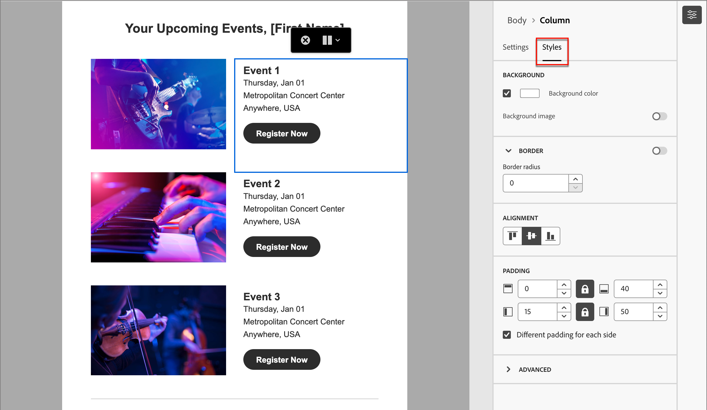

# Authoring dei contenuti - navigazione

Quando si lavora con il contenuto nello spazio di progettazione visivo, è possibile accedere ai componenti, alle colonne e agli elementi di contenuto utilizzando la struttura di navigazione. Fai clic sull&#39;icona _[!UICONTROL Struttura di navigazione]_ (  ) a sinistra per visualizzare la struttura.

{width="800" zoomable="yes"}

L’esempio seguente illustra i passaggi per regolare la spaziatura e l’allineamento verticale all’interno di un componente struttura con le colonne.

1. Selezionare la colonna nel componente struttura direttamente nell&#39;area di lavoro o utilizzando la _struttura di spostamento_ visualizzata a sinistra.

1. Dalla barra degli strumenti della colonna, fare clic sullo strumento _[!UICONTROL Seleziona una colonna]_ e scegliere quello che si desidera modificare.

   Puoi anche selezionarla dall’albero della struttura. I parametri modificabili per tale colonna vengono visualizzati nelle schede _[!UICONTROL Impostazioni]_ e _[!UICONTROL Stili]_ a destra.

   {width="800" zoomable="yes"}

1. Per modificare le proprietà della colonna, fai clic sulla scheda _[!UICONTROL Stili]_ a destra e modificale in base alle tue esigenze:

   * Per **[!UICONTROL Sfondo]**, modifica il colore di sfondo in base alle esigenze.

     Deselezionare la casella di controllo relativa a uno sfondo trasparente. Abilita l&#39;impostazione **[!UICONTROL Immagine di sfondo]** per utilizzare un&#39;immagine come sfondo invece di un colore a tinta unita.

   * Per **[!UICONTROL Allineamento]**, seleziona l&#39;icona _Superiore_, _Centro_ o _Inferiore_.
   * Per **[!UICONTROL Spaziatura interna]**, definire la spaziatura per tutti i lati.

     Selezionare **[!UICONTROL Spaziatura interna diversa per ogni lato]** per ottimizzare la spaziatura. Fai clic sull&#39;icona _Blocca_ per interrompere la sincronizzazione.

   * Espandi la sezione **[!UICONTROL Avanzate]** per definire gli stili in linea per la colonna.

   {width="700" zoomable="yes"}

1. Se necessario, ripeti questi passaggi per regolare l’allineamento e la spaziatura per le altre colonne del componente.

1. Salva le modifiche.
