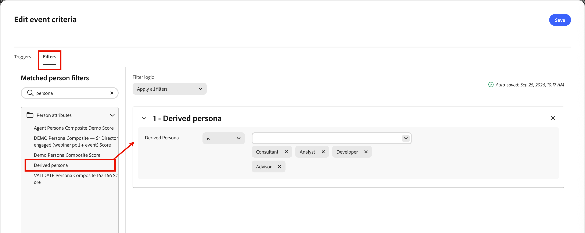

# Mappatura utente tipo

Gli utenti tipo sono un aspetto chiave in un approccio di marketing basato sull’account (ABM) perché aiutano gli esperti di marketing ad adeguare le loro strategie alle esigenze, alle preferenze e ai punti critici specifici degli utenti all’interno degli account target. Gli addetti al marketing possono creare profili dettagliati per ogni persona, indicandone background, responsabilità, punti critici e canali di comunicazione preferiti. Con queste definizioni, gli amministratori possono configurare gli utenti tipo in base agli attributi di persona in [!DNL Adobe Marketo Optimizer] in modo che gli elenchi di persone e i percorsi di persone possano utilizzare un filtro semplice e coerente che acquisisca tali utenti tipo.

In [!DNL Marketo Optimizer], la mappatura persona offre una funzionalità aggiuntiva oltre le condizioni del modello di ruolo: è possibile filtrare [elenchi di persone](../audiences/people-lists.md) e [percorsi di persone](../marketing/person-journeys.md) utilizzando **[!UICONTROL Persona derivata]** come criterio di filtro. Un utente tipo _derivato_ è l&#39;utente tipo dedotto dal sistema per un record persona valutandone gli attributi rispetto a tutte le definizioni utente tipo configurate.

Limitazioni di definizione e utilizzo dell’utente:

* Nell&#39;elenco _[!UICONTROL Mapping persona]_ è possibile definire fino a 20 utenti tipo.
* Ogni utente tipo può includere fino a cinque attributi nella propria definizione.
* In tutti gli utenti tipo definiti, puoi utilizzare fino a dieci attributi persona diversi.

>[!BEGINSHADEBOX]

**Caso d&#39;uso: varianti titolo processo**

Molti team di marketing e vendite utilizzano le qualifiche professionali per identificare utenti tipo diversi all’interno di un account. Tuttavia, i titoli dei contatti possono essere incoerenti e utilizzare numerose varianti per ruoli simili. Quando crei filtri per l’elenco delle persone o condizioni di pubblico per il percorso di persone, potrebbe essere necessario definire ogni possibile posizione correlata per un determinato ruolo. Puoi semplificare queste definizioni e raggruppare persone con titoli di lavoro simili in un utente tipo dedotto, che puoi quindi indirizzare filtrando in base a _Persona derivata è leadership_ invece di far corrispondere i valori dei singoli titoli di lavoro.

>[!ENDSHADEBOX]

## Accedere agli utenti tipo configurati {#access}

Apri il pannello _Mapping persona_ dall&#39;interfaccia [chat](../agents/chat-interface.md) di Coworker.

1. Nel pannello chat, digita `/persona-mapping` e premi **Invio**.

   Questo comando è un collegamento di navigazione, elencato in **[!UICONTROL Apri una pagina]** nel menu barra.

   {width="800" zoomable="yes"}

1. Collaboratore apre il pannello **[!UICONTROL Mappatura persona]** come scheda dell&#39;area di lavoro, con l&#39;elenco degli utenti tipo.

   Da questo pannello puoi [creare](#create-a-persona), [modificare](#edit-a-persona) o [eliminare](#delete-a-persona) utenti tipo.

   L’elenco degli utenti tipo è organizzato in una tabella che mostra ciascun nome utente tipo, la data di creazione e la data dell’ultima modifica. <!-- You can customize the displayed table by clicking the _Column settings_ (  ) icon in the top-right corner and selecting or clearing the column checkboxes. --> Puoi ridurre a icona il pannello chat per aumentare le dimensioni del pannello _Mappatura persona_.

   {width="700" zoomable="yes"}

1. Per accedere ai dettagli di un utente tipo, fai clic sul nome.

### Utenti tipo predefiniti

L&#39;elenco _Mapping persona_ include dieci utenti tipo predefiniti definiti in base all&#39;attributo titolo del processo. Puoi modificare uno di questi utenti tipo predefiniti in base alle esigenze della tua organizzazione:

| Utente tipo | Qualifiche |
| ------- | ---------- |
| CXO/EVP | CEO, CIO, CTO, CMO, CFO, Executive Vice President of Strategy |
| SVP/VP | SVP marketing, VP vendite, SVP operazioni, VP prodotto, VP IT |
| Direttore / Direttore principale | Direttore tecnico, Direttore senior del prodotto, Direttore delle finanze, Direttore del Customer Success |
| Responsabile / Manager senior | Senior Marketing Manager, IT Manager, Operations Manager, Sales Manager, HR Manager |
| Collaboratore individuale | Responsabile dell’account, ingegnere software, specialista di marketing, rappresentante del successo dei clienti |
| Analista | Analista aziendale, analista dati, analista ricerche di mercato, analista finanziario, analista operazioni |
| Sviluppatore | Sviluppatore front-end, sviluppatore back-end, sviluppatore full-stack, sviluppatore app mobile, ingegnere DevOps |
| Personale professionale | Specialista delle risorse umane, Consulente legale, Responsabile per la conformità, Project Manager, Specialista di approvvigionamento |
| Consulente | Consulente di gestione, consulente IT, consulente di processo aziendale, consulente di marketing |
| Altro | Specialista di settore, consulente indipendente, consulente freelance, esperto in materia |

### Filtraggio elenco

Per individuare l’utente tipo desiderato, immetti una stringa di testo nella barra di ricerca in modo che corrisponda agli utenti tipo per nome.

{width="680" zoomable="yes"}

## Creare un utente tipo {#create-a-persona}

1. Fai clic su **[!UICONTROL Crea utente tipo]**.

1. Immetti un **[!UICONTROL Nome]** e una **[!UICONTROL Descrizione]** univoci (facoltativo) per l&#39;utente tipo.

   {width="680" zoomable="yes"}

1. Per **[!UICONTROL Regole]**, selezionare gli attributi da utilizzare per la corrispondenza con l&#39;utente tipo.

   * Fai clic su **[!UICONTROL Modifica regole]**.

   * Nella finestra di dialogo, seleziona la casella di controllo per ogni attributo che desideri mappare (un massimo di cinque).

     Puoi personalizzare la tabella visualizzata facendo clic sull&#39;icona _Impostazioni colonna_ (  ) nell&#39;angolo in alto a destra.

     Per filtrare l&#39;elenco di attributi in base al nome, immettere una stringa di testo nella barra di ricerca. Puoi anche fare clic sull&#39;icona _Filtro_ (  ) in alto a sinistra per filtrare l&#39;elenco visualizzato per tipo, _Standard_ o _Personalizzato_.

     {width="450" zoomable="yes"}

   * Fai clic su **[!UICONTROL Fine]**.

     Gli attributi selezionati sono inseriti nella sezione _[!UICONTROL Attributi personali]_.

   * Per ogni attributo, immettere i valori separati da virgola che si desidera associare per l&#39;attributo.

1. Fai clic su **[!UICONTROL Crea utente tipo]**.

## Modificare un tipo di utente {#edit-a-persona}

Fai clic sul nome dell’utente tipo per accedere e modificare i relativi dettagli.

È possibile modificare il nome o la descrizione, aggiungere attributi o aggiornare i valori degli attributi. Al termine delle modifiche, fai clic su **[!UICONTROL Invia]**.

## Eliminare un utente tipo {#delete-a-persona}

Se si elimina un utente tipo, questo viene rimosso dall&#39;elenco _Mapping persona_ e non è più disponibile come filtro utente tipo derivato negli elenchi persone o nei percorsi di persone.

1. Nella pagina _[!UICONTROL Mapping persona]_ individuare l&#39;utente tipo che si desidera eliminare.

1. Accanto al nome fare clic sui puntini di sospensione (**...**) e scegliere **[!UICONTROL Elimina]**.

1. Nella finestra di dialogo di conferma, fai clic su **[!UICONTROL Elimina]**.

## Filtra per persona derivata {#derived-persona-filter}

Dopo aver configurato gli utenti tipo, [!DNL Marketo Optimizer] deriva un utente tipo per ogni record persona valutando gli attributi del record in base alle mappature utente tipo definite. È possibile utilizzare il risultato dedotto, ovvero _Persona derivata_, come filtro durante la definizione del pubblico per un elenco di persone o un percorso di persone.

Il filtro Persona derivata viene visualizzato nel pannello dei filtri nella categoria **[!UICONTROL Attributi persona]** insieme ad altri attributi dedotti, ad esempio l&#39;appartenenza al percorso.

### Elenchi di persone

Per eseguire il targeting delle persone che corrispondono a un utente tipo specifico configurato durante la gestione degli elenchi di persone, puoi filtrare per Persona derivata.

**Elenco statico — Aggiungi membri**

1. Apri l&#39;elenco statico e fai clic su **[!UICONTROL Aggiungi persone]** in alto a destra.

1. Nella finestra di dialogo del filtro, espandi **[!UICONTROL Attributi persona]** e trascina **[!UICONTROL Persona derivata]** nell&#39;area di lavoro.

   Puoi anche immettere il nome del filtro nel campo di ricerca per individuarlo rapidamente.

   {width="680" zoomable="yes"}

1. Nella condizione del filtro, scegli **[!UICONTROL is]** e seleziona uno o più utenti tipo dall&#39;elenco.

1. Fai clic su **[!UICONTROL Fine]** per applicare il filtro e qualificare le persone corrispondenti nell&#39;elenco.

**Elenco dinamico - Imposta regole di appartenenza**

1. Apri l&#39;elenco dinamico e seleziona la scheda **[!UICONTROL Regole]**.

1. Fai clic su **[!UICONTROL Modifica regole]**.

1. Nella finestra di dialogo del filtro, espandi **[!UICONTROL Attributi persona]** e trascina **[!UICONTROL Persona derivata]** nell&#39;area di lavoro.

   Puoi anche immettere il nome del filtro nel campo di ricerca per individuarlo rapidamente.

1. Nella condizione del filtro, scegli **[!UICONTROL is]** e seleziona uno o più utenti tipo dall&#39;elenco.

1. Fai clic su **[!UICONTROL Fine]** per salvare la regola.

   L’iscrizione viene aggiornata automaticamente quando i record delle persone vengono valutati in base alla regola.

### Percorsi di persone

Quando configuri il pubblico per un percorso di persone utilizzando un pubblico di eventi, puoi utilizzare Persona derivata come filtro del profilo di persona per controllare quali persone entrano nel percorso.

1. Fai clic sul nodo **[!UICONTROL Pubblico persona]** nell&#39;area di lavoro del percorso.

1. Nel pannello delle proprietà del nodo, seleziona **[!UICONTROL Pubblico evento]** come tipo di pubblico.

1. In **[!UICONTROL Filtri profilo persona]**, fare clic su **[!UICONTROL Aggiungi filtro]**.

1. Espandere **[!UICONTROL Attributi persona]** e trascinare **[!UICONTROL Persona derivata]** nell&#39;area di lavoro del filtro.

   Puoi anche immettere il nome del filtro nel campo di ricerca per individuarlo rapidamente.

   {width="680" zoomable="yes"}

1. Nella condizione del filtro, scegli **[!UICONTROL is]** e seleziona uno o più utenti tipo dall&#39;elenco.

   Solo le persone la cui persona derivata corrisponde ai valori selezionati possono entrare nel percorso.

1. Fai clic su **[!UICONTROL Salva]** per salvare i criteri dell&#39;evento.
