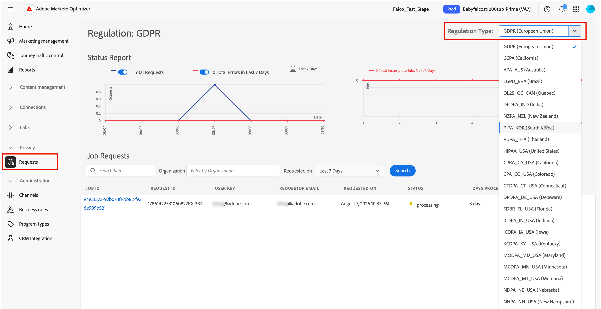

# Gestione della privacy {#privacy-management}

[Adobe Experience Platform Privacy Service](https://experienceleague.adobe.com/it/docs/experience-platform/privacy/home){target="_blank"} fornisce un&#39;API RESTful e un&#39;interfaccia utente per aiutarti a gestire le richieste di dati dei clienti. Con [!DNL Adobe Privacy Service] è possibile inviare richieste di accesso ed eliminazione dei dati personali dei clienti dalle applicazioni Adobe CX Enterprise, semplificando la conformità automatica alle normative legali e organizzative sulla privacy.

[!DNL Adobe Marketo Optimizer] fornisce questi strumenti per la privacy in modo da soddisfare i requisiti di protezione dei dati globali. Utilizzare [!DNL Privacy Service] per inviare e gestire le richieste di accesso ed eliminazione per i dati raccolti e archiviati da [!DNL Marketo Optimizer].

È possibile inviare singole richieste per accedere ed eliminare i dati dei consumatori da [!DNL Adobe Marketo Optimizer] in due modi:

* Interfaccia utente di [!DNL Privacy Service]
* API [!DNL Privacy Service]

## Normative sulla privacy supportate {#regulations}

Gli strumenti per la privacy di [!DNL Marketo Optimizer] consentono di rispettare le normative tramite [!DNL Privacy Service]. Ogni regolamento si applica se conservi dati per persone che risiedono nell’area associata.

Per un elenco aggiornato delle normative supportate, vedere [_Panoramica delle normative sulla privacy_](https://experienceleague.adobe.com/it/docs/experience-platform/privacy/regulations/overview){target="_blank"} nella documentazione di Privacy Service.

## Tipi di richiesta {#access-and-delete-requests}

[!DNL Marketo Optimizer] supporta due tipi di richiesta di accesso a dati personali:

* **Accesso ai dati** - Una persona può richiedere conferma del trattamento dei propri dati personali e ricevere gratuitamente una copia elettronica di tali dati.
* **Eliminazione dei dati** - Chiamato anche _diritto all&#39;oblio_, un utente può richiedere la cancellazione dei propri dati personali e l&#39;interruzione di ulteriori elaborazioni.

## Visualizzare e gestire le richieste di accesso a dati personali {#view-manage-requests}

>[!BEGINSHADEBOX]

 Questi passaggi richiedono il profilo di prodotto [!DNL Privacy Service] e le seguenti [autorizzazioni per il ruolo utente assegnato in Experience Platform](../start/user-management.md#permissions):

* **[!UICONTROL Autorizzazioni Privacy Service]** - `Privacy Read Permission` e `Privacy Write Permission`
* **[!UICONTROL Governance dei dati]** - `View Privacy Console`

Per ulteriori informazioni, vedere [_Gestione delle autorizzazioni per Privacy Service_](https://experienceleague.adobe.com/en/docs/experience-platform/privacy/permissions){target="_blank"} nella Guida di [!DNL Privacy Service].

>[!ENDSHADEBOX]

Per visualizzare i processi di richiesta della privacy in [!DNL Marketo Optimizer], espandi **[!UICONTROL Privacy]** e seleziona **[!UICONTROL Richieste]**.

Utilizza l&#39;opzione **[!UICONTROL Tipo di regolamento]** in alto a destra per modificare la pagina visualizzata per il regolamento che desideri gestire i processi o inviare le richieste.

{width="800" zoomable="yes"}

### Inviare una richiesta {#submit-a-request}

1. Fai clic su **[!UICONTROL Crea richiesta]**.

1. Per **[!UICONTROL Tipo di processo]**, selezionare il tipo di richiesta:

   * **[!UICONTROL Accesso]**

     Quando invii una richiesta di **_accesso_** che include [!DNL Marketo Optimizer], [!DNL Privacy Service] restituisce:

     * Attività [!DNL Marketo Engage] associata al lead.
     * Attività [!DNL Marketo Optimizer] associata alla persona o all&#39;account.

   * **[!UICONTROL Elimina]**

     Quando si invia una richiesta **delete** per [!DNL Marketo Engage] e [!DNL Marketo Optimizer], i record seguenti vengono rimossi:

     * Il lead associato in [!DNL Marketo Engage].
     * Record di persone e account creati in [!DNL Marketo Optimizer].
     * Cronologia conversazioni del collaboratore che fa riferimento alle informazioni personali dell&#39;utente.

1. Per **[!UICONTROL Prodotti]**, seleziona **[!UICONTROL Marketo]**.

   {width="450" zoomable="yes"}

   Questa selezione include dati sia di [!DNL Marketo Optimizer] che dell&#39;istanza [!DNL Marketo Engage].

1. Scorri fino alla parte inferiore della finestra di dialogo e immetti l’indirizzo e-mail della persona di cui desideri accedere o eliminare i dati.

1. Per inviare la richiesta, fare clic su **[!UICONTROL Crea]**.

   [!DNL Privacy Service] restituisce un ID richiesta che è possibile utilizzare per controllare lo stato della richiesta.

### Richieste API {#api-requests}

È inoltre possibile inviare richieste di privacy utilizzando l&#39;API [!DNL Privacy Service]. Per informazioni generali sulle API, consulta la [documentazione sulle API Privacy Service](https://developer.adobe.com/experience-platform-apis/references/privacy-service){target="_blank"}.

>[!PREREQUISITES]
>
>Raccogli le seguenti informazioni prima di inviare una richiesta:
>
>* L&#39;ID organizzazione IMS dell&#39;organizzazione (una stringa alfanumerica di 24 caratteri che termina con `@AdobeOrg`). Contatta il supporto Adobe all’indirizzo `gdprsupport@adobe.com` se non conosci il tuo ID organizzazione IMS.
>* L’indirizzo e-mail della persona di cui desideri accedere o eliminare i dati.

Utilizza i seguenti valori di campo nella richiesta:

| Campo | Valore |
|---|---|
| `companyContexts.namespace` | `imsOrgID` |
| `companyContexts.value` | ID organizzazione IMS |
| `users.action` | `access` o `delete` |
| `users.userIDs.namespace` | `Email` |
| `include` | `marketo` per includere sia i dati [!DNL Marketo Optimizer] che quelli [!DNL Marketo Engage] |
| `regulation` | Esempio: `ccpa` <br/>Alcuni valori di regolamento vengono modificati per includere un&#39;abbreviazione di stato (ad esempio, `ucpa_ut_usa`). I valori precedenti rimangono validi per un periodo di transizione. Consulta la [Panoramica delle normative sulla privacy](https://experienceleague.adobe.com/it/docs/experience-platform/privacy/regulations/overview){target="_blank"} per l&#39;elenco corrente prima di creare integrazioni in base a questi valori. |

Nell&#39;esempio seguente viene inviata una richiesta di eliminazione RGPD che include i dati [!DNL Marketo Optimizer].

```json
{
  "companyContexts": [
    {
      "namespace": "imsOrgID",
      "value": "1231659F56A68A8B7F000101@AdobeOrg"
    }
  ],
  "users": [
    {
      "action": ["delete"],
      "userIDs": [
        {
          "namespace": "Email",
          "type": "standard",
          "value": "john.doe@adobe.com"
        }
      ]
    }
  ],
  "include": ["marketo"],
  "regulation": "gdpr"
}
```

[!DNL Privacy Service] restituisce una risposta simile alla seguente.

```json
{
  "requestId": "16331241037112570RX-245",
  "totalRecords": 1,
  "jobs": [
    {
      "jobId": "997b01e3-9568-402c-904b-b4e60a437875",
      "customer": {
        "user": {
          "action": ["delete"],
          "userIDs": [
            {
              "namespace": "Email",
              "value": "john.doe@adobe.com",
              "type": "standard",
              "namespaceId": 6,
              "isDeletedClientSide": false
            }
          ]
        }
      }
    }
  ]
}
```
