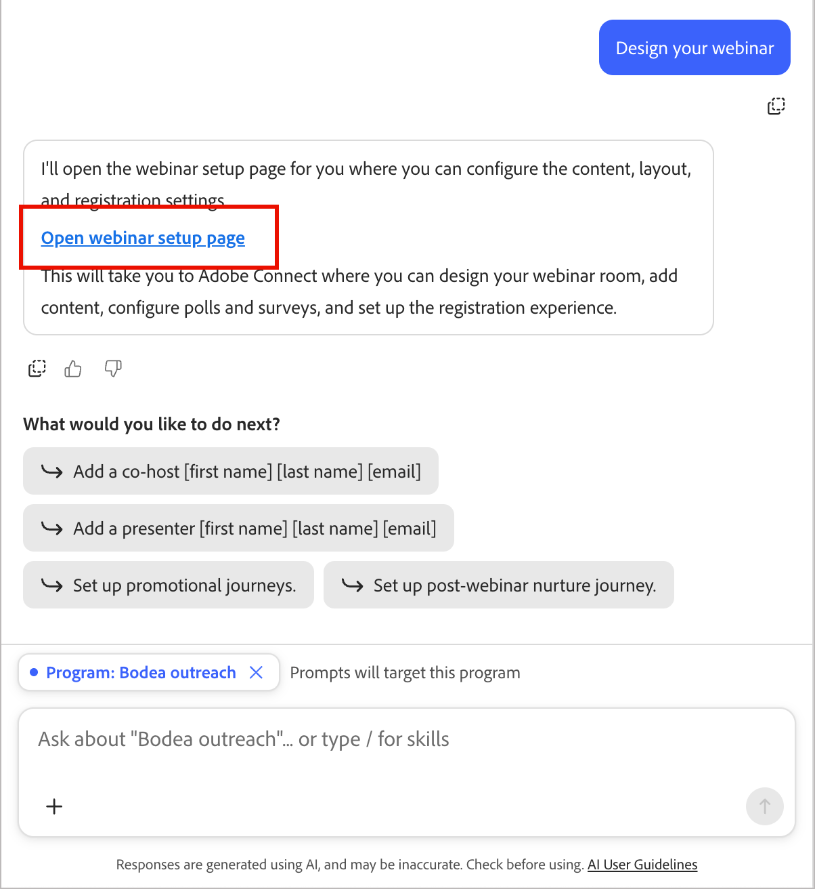

# Creare e promuovere webinar

L&#39;interfaccia [chat](./chat-interface.md) può portare un webinar dalla creazione alla promozione, alla consegna, alla creazione di post-webinar e al reporting, interamente tramite il riquadro di conversazione. Tutto ciò che viene creato dall&#39;interfaccia chat utilizza la stessa risorsa, gli stessi percorsi e gli stessi token del webinar descritti in [Panoramica sui webinar interattivi](../marketing/webinars-overview.md), in modo da poter passare dalla chat all&#39;interfaccia di progettazione in qualsiasi momento.

## Punti di ingresso

Dal saluto &quot;Benvenuti alla gestione del marketing&quot;, seleziona il chip di categoria **[!UICONTROL Webinar]** per visualizzare i prompt suggeriti, tra cui:

* *&quot;Pianificazione e consegna di un webinar&quot;*
* *&quot;Mostra tutti i miei prossimi webinar&quot;*
* *&quot;Fornisci i dettagli del webinar [nome webinar]&quot;*

{width="700" zoomable="yes"}

Quando si apre il riquadro della chat dall&#39;interno di un programma, viene visualizzato automaticamente un messaggio di richiesta per tale programma.

## Aggiungi un webinar pianificato {#add-webinar}

Descrivi il webinar desiderato in un singolo messaggio, ad esempio:

*&quot;Creare un webinar interattivo denominato &#39;Cybersecurity 101: Protecting Your Data From Modern Threats&#39; il 12 ottobre 2026 alle 16:00 America/Los_Angeles per [programma].&quot;*

1. Il riquadro chat mostra un elenco di controllo **Piano attività** e funziona tramite di esso: risolvere il programma, impostare il nome, l&#39;ora di inizio, l&#39;ora di fine, il fuso orario e la capacità, quindi confermare.

   {width="500" zoomable="yes"}

1. Nel riquadro chat sono elencate le **licenze** disponibili nel webinar, ad esempio un componente aggiuntivo ad alta capacità con il relativo valore di capacità, e viene richiesto quale utilizzare. Rispondere con la capacità desiderata, ad esempio *&quot;Utilizzare la capacità del webinar a 1000&quot;*

   {width="500" zoomable="yes"}

1. Nel riquadro della chat vengono riprodotti il programma, il nome, l&#39;ora di inizio, il fuso orario, la durata e la capacità e viene richiesto di **confermare** prima di creare il webinar.

1. Dopo aver creato il webinar, l&#39;interfaccia di chat visualizza una **scheda del webinar** con l&#39;ora di inizio e di fine, la durata, l&#39;host, la capacità, il provider (Adobe Connect), un URL di configurazione, un URL di avvio, un collegamento al dashboard di coinvolgimento e i metadati di creazione.

1. L&#39;interfaccia chat offre quindi **azioni migliori**: _Progettare il webinar_, _Aggiungere un co-host_, _Aggiungere un relatore_, _Configurare percorsi promozionali_ e _Configurare il percorso di sviluppo post-webinar_.

   {width="500" zoomable="yes"}

### Aggiungere co-host e relatori {#co-hosts-presenters}

Seleziona **[!UICONTROL Aggiungi un co-host]** o **[!UICONTROL Aggiungi un relatore]** dalle azioni migliori successive oppure chiedi direttamente, ad esempio *&quot;Aggiungi un co-host [nome] [cognome] [e-mail].&quot;* L’interfaccia della chat apre la stessa finestra di dialogo di aggiunta utilizzata nella finestra di progettazione: immetti un nome e un messaggio e-mail, poiché attualmente tutti vengono aggiunti nello stesso modo anziché selezionati da un selettore di elenco. Una volta aggiunta la persona, viene visualizzata una conferma.

{width="500" zoomable="yes"}

### Progettare il webinar

Seleziona **[!UICONTROL Progetta il tuo webinar]** per aprire la pagina di configurazione del webinar, in cui puoi configurare le impostazioni di contenuto, layout e registrazione nell&#39;area di progettazione [!DNL Adobe Connect] incorporata. Completa eventuali modifiche di progettazione nell’interfaccia; l’interfaccia di chat ti collega lì invece di progettare la chat room. Consulta [Progettare il webinar](../marketing/create-webinar.md#create-and-design-a-webinar).

{width="500" zoomable="yes"}

## Creazione di un percorso di promozione

1. Chiedi all&#39;interfaccia di chat di impostare un percorso promozionale.

   Ti chiede di scegliere un modello e di denominare il percorso, ad esempio *&quot;percorso di invito/registrazione&quot;*

1. L’interfaccia di chat crea il percorso e collega le e-mail ai relativi nodi, creando un flusso di inviti e promemoria con gli aggiornamenti dello stato dei membri del webinar.

1. L’interfaccia di chat elenca ciò che rimane da configurare nell’area di lavoro del percorso.

1. Fai clic su **[!UICONTROL Modifica nodi percorso]** e rispondi alle richieste di informazioni su ciò che è necessario completare il percorso.

   Puoi caricare un documento della campagna per fornire i dettagli, oppure continuare con la chat per identificare ciò che è necessario.

   In alternativa, puoi lavorare direttamente nell’area di lavoro del percorso per risolvere ciascun nodo:

   * Seleziona il primo nodo di percorso e imposta il pubblico di percorso. [Ulteriori informazioni](../marketing/person-audience-node.md)
   * Seleziona il nodo _Invia e-mail_ e fai clic su **[!UICONTROL Modifica e-mail]**. [Ulteriori informazioni](../marketing/email-channel.md)
   * Selezionare il nodo Ascolta un evento e fare clic su **[!UICONTROL Modifica evento]**. Impostare il filtro eventi per il modulo di registrazione sull&#39;evento _Compila modulo_. [Ulteriori informazioni](../marketing/listen-for-event-nodes.md#event-filters)
   * Verificare i campi **[!UICONTROL Cambia stato membro del webinar]** in ogni nodo di modifica dello stato. [Ulteriori informazioni](../marketing/action-nodes.md#actions-and-constraints)

1. Completa la configurazione degli altri nodi e indirizzo

1. Al termine, fai clic su **[!UICONTROL Pubblica ora]** per rendere il percorso attivo e iniziare la promozione.

## Creazione di un percorso di post-webinar

1. Chiedi all’interfaccia di chat un percorso post-webinar.

   Viene richiesto di specificare un modello e un nome.

1. L&#39;interfaccia di chat crea un nodo **Percorso suddiviso** con percorsi e azioni definiti:

   * Un ramo **_Partecipato_** (ad esempio, una risposta e risorse _Invia e-mail_ nodo)
   * Un ramo **_No-Show_** (ad esempio, un ramo &quot;ha saltato? guarda di nuovo&quot; _Invia e-mail_ nodo)

   E a ciascuno è seguito un nodo _Wait_ e un nodo _Send email_ di follow-up.

   La condizione di suddivisione è impostata per identificare lo stato del webinar utilizzando _Ha partecipato al webinar_.

1. Fai clic su **[!UICONTROL Modifica nodi percorso]** e rispondi alle richieste di informazioni su ciò che è necessario completare il percorso.

   Puoi caricare un documento della campagna per fornire i dettagli, oppure continuare con la chat per identificare ciò che è necessario.

   In alternativa, puoi lavorare direttamente nell’area di lavoro del percorso per gestire ogni nodo.

1. Completa la configurazione degli altri nodi e indirizzo

1. Al termine, fai clic su **[!UICONTROL Pubblica ora]** per rendere attivo il percorso e iniziare il follow-up.

## Verifica reporting

Nell&#39;interfaccia di chat, puoi porre domande di reporting come *&quot;Mostra tutti i miei prossimi webinar&quot;* o *&quot;Fornisci i dettagli del webinar [name]&quot;*. Mostra il collegamento del dashboard di coinvolgimento insieme alle azioni migliori successive, ad esempio **Progettazione**, **Aggiungi co-host** o **Pubblica nella data del webinar**.

Per analisi più approfondite, quali la partecipazione, le prestazioni di sondaggi e sondaggi e i dati per membro, l&#39;interfaccia chat si collega alle schede **Analytics** e **Membri** del webinar e al rollup tra i programmi in **Gestione webinar**. <!-- See [Webinar reporting](https://experienceleague.adobe.com/en/docs/journey-optimizer-b2b/prime/marketing-management/webinars/webinar-reporting). -->
