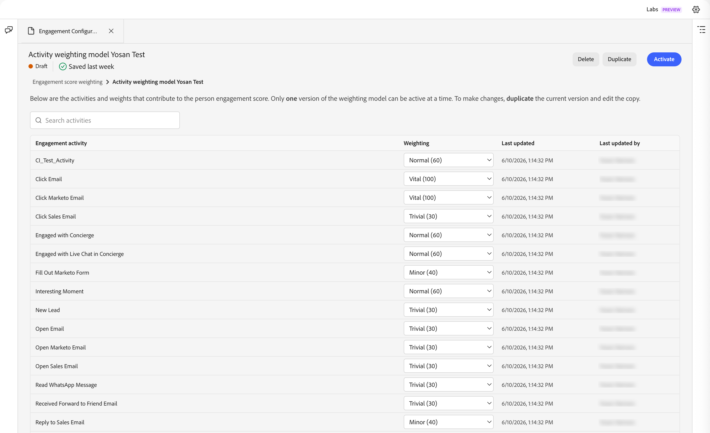

# Punteggi di coinvolgimento della persona {#engagement-scores}

>[!CONTEXTUALHELP]
>id="ajo-b2b-prime_person_engagement_score"
>title="Punteggio di coinvolgimento della persona"
>abstract="I punteggi di coinvolgimento della persona riflettono il livello di coinvolgimento dei singoli lead in base alle attività recenti."

Un punteggio di coinvolgimento della persona è un numero che riflette il livello di coinvolgimento di un singolo lead. I punteggi si basano sulle attività svolte da una persona, in cui ogni tipo di attività ha un valore ponderato. I punteggi vengono normalizzati all’interno dell’istanza (tenant) per consentire un confronto coerente e informazioni fruibili.

Il calcolo del punteggio viene eseguito ogni giorno. Qualsiasi attività ponderata per il coinvolgimento eseguita dalla persona negli ultimi 30 giorni contribuisce al punteggio. Con questo intervallo continuo di 30 giorni, le occorrenze di attività più vecchie scadono e i punteggi possono diminuire nel tempo (decadimento del punteggio). I punteggi visualizzati vengono arrotondati (ad esempio, un punteggio di 75,89999 viene visualizzato come 76).

I dati del punteggio di coinvolgimento sono disponibili da **[!UICONTROL Report]**.

{width="800" zoomable="yes"}

Il punteggio di coinvolgimento della persona è un attributo utilizzabile come [condizione filtro](#engagement-score-filter) negli elenchi di persone e nei nodi dei percorsi suddivisi nei percorsi di persone.

## Attività utilizzate per il punteggio di coinvolgimento {#activities}

Il punteggio di coinvolgimento non è _basato su trigger_. Si tratta di un processo giornaliero che valuta l’attività per tutti i lead e ricalcola i punteggi. Le attività utilizzano _pesi_ per informare il punteggio in base al modello di ponderazione attivo, che determina il contributo di ogni tipo di attività al punteggio complessivo.

Per ogni tipo di attività esiste un limite di frequenza giornaliero di 20. Se una persona esegue la stessa attività più di 20 volte in un singolo giorno, il conteggio per tale attività è limitato a 20.

| Nome attività | Direzione | Descrizione | Spessore predefinito |
|---|---|---|---|
| Partecipa alla conferenza | In entrata | Segnale di coinvolgimento di persona ad alto intento | 60 |
| Fai clic sull’e-mail | In entrata | Clic attivo = coinvolgimento significativo | 30 |
| Fai clic sull’e-mail vendite | In entrata | Clic attivo sulla distribuzione delle vendite | 30 |
| Fai clic su E-mail Marketo | In entrata | Clic attivo = coinvolgimento significativo | 30 |
| Coinvolto con il portinaio | In entrata | Coinvolgimento live tramite strumento di consulenza | 60 |
| Coinvolto con chat in diretta in Concierge | In entrata | Chat in tempo reale = elevato intento di acquisto | 60 |
| Compila Marketo Form | In entrata | Compilazione modulo = intento cliente potenziale esplicito | 40 |
| Momento interessante | In entrata | Trigger comportamentale di alto valore | 60 |
| Nuovo lead | In entrata | Punto di ingresso — punteggio linea di base | 30 |
| Apri e-mail | In entrata | Coinvolgimento passivo; inferiore al clic | 30 |
| Apri e-mail Marketo | In entrata | Coinvolgimento passivo; inferiore al clic | 30 |
| Apri e-mail vendite | In entrata | Coinvolgimento passivo; inferiore al clic | 30 |
| Leggi messaggio WhatsApp | In entrata | Lettura passiva; canale meno pesante | 30 |
| Ricevuto Inoltra a e-mail amico | In entrata | Segnale virale; lieve positivo | 30 |
| Rispondi a e-mail vendite | In entrata | Risposta diretta = forte segnale di acquisto | 40 |
| Richiedere campagna | In entrata | Azione avviata dall&#39;utente - intento elevato | 30 |
| Richiedi campagna Marketo | In entrata | Azione avviata dall&#39;utente - intento elevato | 30 |
| Riunione programmata in Concierge | In entrata | Azione di conversione intento massimo | 60 |

>[!NOTE]
>
>Le attività con punteggio di coinvolgimento vengono registrate nel registro attività di Marketo Engage per una persona. Puoi accedere a questo registro nell’istanza Marketo Engage associata. Per ulteriori informazioni, vedere [Individuare il registro attività per una persona](https://experienceleague.adobe.com/it/docs/marketo/using/product-docs/core-marketo-concepts/smart-lists-and-static-lists/managing-people-in-smart-lists/locate-the-activity-log-for-a-person){target="_blank"} nella documentazione di Marketo Engage.

## Logica di punteggio {#scoring-logic}

Il sistema applica un processo di normalizzazione in più fasi per produrre un punteggio coerente su tutti i lead nella tua istanza.

1. Identifica tutti i tipi di attività _engagement-weighted_ a cui sono associati peso e quota giornaliera, ad esempio clic su e-mail, riempimenti di moduli e partecipazione a eventi.

1. Identifica tutte le azioni _engagement-weighted_ eseguite dalla persona nell&#39;intervallo di look-back, che attualmente è di 30 giorni.

1. Normalizza il peso del tipo di attività tra tutti i tipi di attività _engagement-weighted_ identificati nel passaggio 1, ignorando i tipi che non si sono verificati nell&#39;intervallo di look-back.

   Questo passaggio utilizza _Normalizzazione min-max_ e riduce la diluizione artificiale del peso del tipo di attività per le istanze che non utilizzano la maggior parte dei tipi di attività.

1. Applica il limite di frequenza giornaliero per persona e tipo di attività.

   Questo passaggio riduce l’influenza delle attività di volume elevato e valore inferiore sul punteggio complessivo.

1. Calcola il punteggio di coinvolgimento non elaborato sommando l’attività giornaliera per tipo di attività, moltiplicandola per il peso associato e quindi sommando i risultati per tutti i giorni nell’intervallo di lookback.

1. Per stabilizzare la varianza riducendo l&#39;impatto degli outlier, applicare una _trasformazione di potenza_ (Radice quadrata).

   Questa trasformazione riduce lo sfasamento e rende i pattern nei dati più lineari.

1. Per garantire che i punteggi utilizzino l&#39;intervallo completo compreso tra 0 e 100, applicare una trasformazione _Normalizzazione ridimensionata_.

## Filtra per punteggio di coinvolgimento {#engagement-score-filter}

Puoi utilizzare i punteggi di coinvolgimento delle persone come filtro quando definisci il pubblico per un elenco di persone o per la segmentazione in un percorso di persone.

Il filtro _[!UICONTROL Punteggio coinvolgimento persona]_ viene visualizzato nel pannello dei filtri nella categoria **[!UICONTROL Attributi persona]**.

### Elenchi di persone {#people-lists}

Quando gestisci i membri in un [elenco di persone statiche](./people-lists.md#static-lists) o definisci regole per un [elenco di persone dinamiche](./people-lists.md#dynamic-lists), puoi filtrare in base al punteggio di coinvolgimento della persona per eseguire il targeting delle persone che corrispondono ai tuoi criteri.

{width="700" zoomable="yes"}

**Elenco statico — Aggiungi membri**

1. Apri l&#39;elenco statico e fai clic su **[!UICONTROL Aggiungi persone]** in alto a destra.

1. Nella finestra di dialogo del filtro, espandi **[!UICONTROL Attributi persone]** e trascina **[!UICONTROL Punteggio coinvolgimento persona]** nell&#39;area di lavoro.

1. Nella condizione del filtro, scegli un operatore e inserisci un valore che corrisponda ai punteggi di cui desideri eseguire il targeting.

1. Fai clic su **[!UICONTROL Fine]** per applicare il filtro e qualificare le persone corrispondenti nell&#39;elenco.

**Elenco dinamico - Imposta regole di appartenenza**

1. Apri l&#39;elenco dinamico e seleziona la scheda **[!UICONTROL Regole]**.

1. Fai clic su **[!UICONTROL Modifica regole]**.

1. Nella finestra di dialogo del filtro, espandi **[!UICONTROL Attributi persone]** e trascina **[!UICONTROL Punteggio coinvolgimento persona]** nell&#39;area di lavoro.

1. Nella condizione del filtro, scegli un operatore e inserisci un valore che corrisponda ai punteggi di cui desideri eseguire il targeting.

1. Fai clic su **[!UICONTROL Fine]** per salvare la regola.

   L’iscrizione viene aggiornata automaticamente quando i record delle persone vengono valutati in base alla regola.

### Percorsi di persone {#person-journeys}

Quando configuri la segmentazione per un percorso di persone in un nodo [_Percorsi suddivisi_](../marketing/split-merge-paths-nodes.md), puoi utilizzare il punteggio di coinvolgimento della persona come filtro del profilo della persona per controllare quali persone entrano nel percorso del percorso.

{width="700" zoomable="yes"}

1. Fare clic sul nodo **[!UICONTROL Percorsi suddivisi]** nell&#39;area di lavoro del percorso.

1. Nel pannello delle proprietà del nodo a destra, fai clic su **[!UICONTROL Applica condizione]** o **[!UICONTROL Modifica condizione]** per un percorso.

1. Nella finestra di dialogo del filtro, espandi **[!UICONTROL Attributi persone]** e trascina **[!UICONTROL Punteggio coinvolgimento persona]** nell&#39;area di lavoro.

1. Nella condizione del filtro, scegli un operatore e inserisci un valore che corrisponda ai punteggi di cui desideri eseguire il targeting.

1. Fai clic su **[!UICONTROL Fine]** per salvare il filtro per il percorso.

## Configurare la ponderazione dei punteggi di coinvolgimento {#configure-weighting}

In [!DNL Marketo Optimizer], puoi configurare la ponderazione del punteggio di coinvolgimento direttamente dall&#39;[interfaccia chat di Coworker](../agents/chat-interface.md).

Per informazioni di base sui modelli di punteggio di coinvolgimento, sulle fasce di ponderazione e sui pesi delle attività, consulta [Configurare la ponderazione del punteggio di coinvolgimento personalizzato](https://experienceleague.adobe.com/en/docs/journey-optimizer-b2b/user/admin/configurations/engagement-score-weighting).

1. Apri il pannello chat di **[!UICONTROL Collaboratore]** dal lato sinistro della schermata (icona chat).

1. Nel campo di input della chat, digita il comando barra seguita dall’intento. Ad esempio:

   `/engagement-configuration Configure activity weights for the person engagement score model`

   Quando si digita `/`, in Collaboratore viene visualizzato un elenco dei comandi e delle abilità barra disponibili. Il comando di configurazione dell&#39;engagement indirizza direttamente alla pagina Ponderazione dei punteggi di coinvolgimento.

   {width="700" zoomable="yes"}

1. Fai clic sull&#39;icona _Invia_ (freccia su) o premi Invio.

   Collaboratore elabora la richiesta e apre una scheda **[!UICONTROL Configurazione coinvolgimento]** nell&#39;area contenuto principale accanto al pannello chat.

### Rivedi la lista di ponderazione dei punteggi di coinvolgimento {#review-weighting-list}

Dopo l&#39;apertura della scheda, nella pagina _Ponderazione punteggio di coinvolgimento_ vengono visualizzati tutti i modelli di punteggio esistenti in una tabella con le colonne seguenti:

| Colonna | Descrizione |
|---|---|
| **Nome** | Nome del modello (fare clic per aprire i dettagli) |
| **Stato** | Attivo, Bozza o Archiviato |
| **Data di creazione** | Quando è stato creato il modello |
| **Ultimo aggiornamento** | Timestamp di salvataggio più recente |
| **Ultimo aggiornamento effettuato da** | Utente che ha salvato per ultimo le modifiche |

{width="700" zoomable="yes"}

In un dato momento, solo il modello **one** può essere attivo. Il modello attualmente attivo viene applicato a tutti i calcoli del punteggio di coinvolgimento.

### Aprire un modello di punteggio {#open-scoring-model}

Fai clic sul nome di qualsiasi modello nell’elenco per aprire la relativa pagina dei dettagli.

La pagina dei dettagli mostra:

* Nome modello e badge di stato corrente (_Attivo_, _Bozza_ o _Archiviato_)
* Un campo _Ricerca_ per filtrare l&#39;elenco attività
* Tabella attività completa con **[!UICONTROL Attività di coinvolgimento]**, **[!UICONTROL Ponderazione]**, **[!UICONTROL Ultimo aggiornamento]** e **[!UICONTROL Ultimo aggiornamento eseguito da]** colonne

{width="700" zoomable="yes"}

Per i modelli archiviati, in alto a destra vengono visualizzati **[!UICONTROL Elimina]** e **[!UICONTROL Duplica]**. Per i modelli bozza, viene visualizzato anche **[!UICONTROL Attiva]**.

### Modificare i pesi delle attività per un modello 2D {#edit-activity-weights}

I modelli bozza presentano opzioni _[!UICONTROL Ponderazione]_ modificabili per ogni attività di coinvolgimento. Per modificare lo spessore:

1. Fate clic sul nome del modello 2D nell&#39;elenco.

1. Nella tabella delle attività individuare l&#39;attività di coinvolgimento che si desidera aggiornare.

1. Fare clic sulla freccia verso il basso **[!UICONTROL Ponderazione]** per l&#39;attività e selezionare la fascia di ponderazione appropriata (ad esempio, `Important`, `Trivial`, `Minor`, `Normal` e `Vital`).

   Le modifiche vengono salvate automaticamente. Non è richiesta alcuna azione di salvataggio esplicita.

>[!NOTE]
>
>Per modificare un modello attivo o archiviato, duplicalo per creare un nuovo modello 2D, quindi modifica e attiva il duplicato. Non è possibile modificare un modello attivo nella stessa posizione.

### Attivare un modello 2D {#activate-weighting-model}

L&#39;attivazione di un modello 2D consente di archiviare automaticamente il modello precedentemente attivo. Il modello appena attivato viene quindi applicato a tutti i calcoli futuri del punteggio di coinvolgimento. Quando il modello bozza è configurato con i pesi di attività corretti:

1. Fate clic sul nome del modello 2D nell&#39;elenco.

1. Fai clic su **[!UICONTROL Attiva]** in alto a destra.

1. Conferma nella finestra di dialogo.

