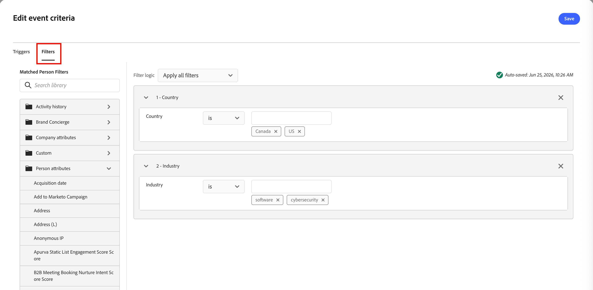

# Pubblico basato su eventi

In [!DNL Adobe Marketo Optimizer], _i tipi di pubblico basati su eventi_ ti consentono di aggiungere membri del pubblico a un [percorso di persone](../marketing/person-journeys.md) in tempo reale quando si verifica un&#39;attività [!DNL Marketo Engage]. Puoi configurare i tipi di pubblico basati su eventi sul nodo Pubblico dell’area di lavoro del percorso:

* Seleziona una o più attività [!DNL Marketo Engage] (standard o personalizzate) come eventi qualificanti.
* Facoltativamente, aggiungi i filtri del profilo della persona (ad esempio settore, regione o fase del ciclo di vita) per limitare le persone che possono entrare.
* Facoltativamente, definisci i vincoli dell’attributo dell’attività (ad esempio un modulo, un URL o un programma specifico) per limitare le occorrenze di ciascuna attività idonee.

Quando un&#39;attività idonea viene registrata in [!DNL Marketo Engage] per un lead e replicata in [!DNL Adobe Marketo Optimizer], il sistema valuta il record persona corrispondente in base ai filtri e ai vincoli configurati. Se le condizioni sono soddisfatte, la persona entra nel percorso immediatamente tramite il nodo Pubblico.

_Per definire un pubblico basato su eventi per un percorso di persone :_

1. Selezionare il nodo [_Pubblico persona_](../marketing/person-audience-node.md).

1. Nelle proprietà del nodo a destra, scegli **[!UICONTROL Pubblico evento]** come tipo di voce.

   {width="400"}

1. Fare clic su **[!UICONTROL Aggiungi criteri evento]**.

1. Nella finestra di dialogo _[!UICONTROL Modifica criteri evento]_, aggiungi una o più attività [!DNL Marketo Engage] come eventi qualificati, ad esempio:

   * _Partecipa al webinar_
   * _E-mail consegnata_
   * _Clic sul collegamento nell&#39;e-mail_

   >[!NOTE]
   >
   >È inoltre possibile selezionare le attività personalizzate definite nell&#39;istanza [!DNL Marketo Engage] associata.

   Imposta l&#39;operatore e i valori corrispondenti per ogni attività.

   {width="700" zoomable="yes"}

   Una persona è idonea per il percorso quando una qualsiasi di queste attività configurate viene registrata per quel lead.

1. (Facoltativo) Per utilizzare una combinazione di evento e filtro per la qualifica del pubblico, aggiungi filtri a livello di persona.

   * Selezionare la scheda **[!UICONTROL Filtri]**.
   * Trascina ciascun filtro e imposta i criteri di corrispondenza.

   {width="700" zoomable="yes"}

   Se aggiungi dei filtri, la persona deve soddisfare almeno una condizione di attività configurata e i filtri configurati.

1. Fai clic su **[!UICONTROL Salva]**.