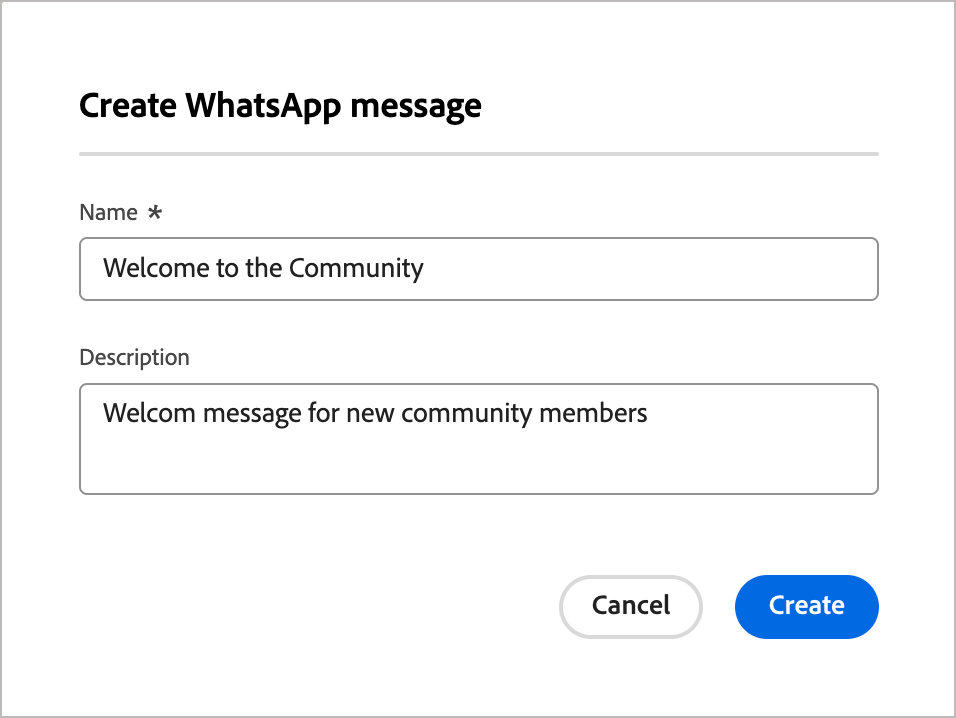

# Authoring WhatsApp

Utilizza [!DNL Adobe Marketo Optimizer] per inviare messaggi WhatsApp a persone sui loro dispositivi mobili. Puoi creare, personalizzare e visualizzare in anteprima i messaggi utilizzando modelli di messaggio approvati da Meta dall’editor WhatsApp.

Prima di creare messaggi WhatsApp per percorsi di persone, assicurati di disporre di un [canale WhatsApp configurato](../admin/configuration-channels-whatsapp.md) nelle impostazioni _[!UICONTROL Amministratore]_.

>[!NOTE]
>
>In [!DNL Marketo Optimizer] sono supportati solo gli elementi di messaggio WhatsApp _in uscita_.

+++ Elementi del messaggio supportati e opzioni call-to-action

Utilizza le tabelle in questa sezione come riferimento per il contenuto WhatsApp in uscita che puoi includere nei modelli di Meta approvati e per i pulsanti interattivi che puoi aggiungere ai messaggi.

Nella tabella seguente sono riepilogati gli elementi del messaggio supportati e i relativi requisiti.

| Elemento del messaggio | Descrizione |
| - | - |
| Intestazioni | Testo opzionale visualizzato sopra il corpo del messaggio. |
| Testo | Supporta il contenuto dinamico tramite parametri. |
| Immagini (JPEG, PNG) | Deve essere in formato RGB o RGBA a 8 bit e di dimensioni inferiori a 5 MB. |
| Video | Deve essere 3GPP o MP4, di dimensioni inferiori a 16 MB e in hosting tramite URL. |
| Audio | Disponibile solo per i messaggi di risposta. Deve essere in formato AAC, AMR, MP3, MP4 audio o OGG, ospitato su un URL e inferiore a 16 MB. |
| Documenti | Deve essere inferiore a 100 MB, ospitato su un URL e in uno dei seguenti formati: `.txt`, `.xls`/`.xlsx`, `.doc`/`.docx`, `.ppt`/`.pptx` o `.pdf`. |
| Corpo del testo | Supporta il contenuto dinamico tramite parametri. |
| Testo piè di pagina | Supporta il contenuto dinamico tramite parametri. |

Nella tabella seguente sono elencati i tipi di pulsanti di call-to-action e il comportamento di ciascuno di essi nel messaggio.

| Call to action | Descrizione |
| - | - |
| Visita il sito web | È consentito un solo pulsante, con parametri variabili inclusi. |
| Chiamata su WhatsApp | Fornisce un pulsante che apre una chat WhatsApp con il numero di telefono specificato direttamente dal messaggio. |
| Numero di telefono della chiamata | Fornisce un pulsante che avvia una chiamata telefonica al numero specificato quando viene toccato dall&#39;utente. |

+++

## Aggiungere un’azione WhatsApp in un percorso di persone {#add-whatsapp-journey-action}

>[!IMPORTANT]
>
>**Gestione del consenso WhatsApp**: in conformità ai criteri di Meta e alle normative applicabili, tutti i messaggi di marketing WhatsApp devono essere inviati solo ai destinatari che hanno acconsentito alla ricezione di comunicazioni. I destinatari WhatsApp possono rinunciare in qualsiasi momento rispondendo con una parola chiave di rinuncia. Le risposte di rinuncia vengono rispettate automaticamente e i profili corrispondenti vengono rimossi dai futuri tipi di pubblico dei messaggi di marketing.

Puoi impostare le consegne dei messaggi WhatsApp in un percorso di persone quando [aggiungi un _[!UICONTROL Esegui un&#39;azione]_ nodo](../marketing/action-nodes.md) e scegli **[!UICONTROL Invia WhatsApp]** dall&#39;elenco delle azioni.

## Creare il messaggio WhatsApp {#create-whatsapp-message}

1. Nella parte inferiore del pannello _[!UICONTROL Esegui un&#39;azione]_, fai clic su **[!UICONTROL Crea WhatsApp]**.

1. Nella finestra di dialogo, immetti un **[!UICONTROL Nome]** (obbligatorio) e una **[!UICONTROL Descrizione]** (facoltativo) univoci per il messaggio WhatsApp.

   {width="400"}

1. Fai clic su **[!UICONTROL Crea]**.

   Viene aperto lo _spazio di progettazione WhatsApp_ in cui è possibile definire le azioni WhatsApp e creare il contenuto per l&#39;invio del messaggio.

### Seleziona la configurazione delle azioni {#select-actions-configuration}

1. Nello spazio di progettazione di _WhatsApp_, seleziona la scheda **[!UICONTROL Azioni]**.

1. Per **[!UICONTROL Configurazione WhatsApp]**, seleziona la configurazione che supporta le azioni di marketing e le impostazioni di consegna dei messaggi in base alle tue esigenze.

   {width="700" zoomable="yes"}

1. Fare clic su **[!UICONTROL Modifica contenuto]** per passare ai parametri e al testo del messaggio.

### Seleziona un modello di messaggio {#select-message-template}

I messaggi WhatsApp vengono inviati utilizzando modelli di messaggio preapprovati dal tuo account aziendale Meta WhatsApp. **I modelli devono essere revisionati e approvati da Meta** prima di poter essere utilizzati in [!DNL Marketo Optimizer]. Per gestire e inviare i modelli per l&#39;approvazione, rivolgersi all&#39;amministratore dell&#39;account [!DNL Meta Business Manager].

1. Per **[!UICONTROL Selezionare la categoria modello]**, scegliere una delle opzioni seguenti:

   * Marketing
   * Utilità
   * Autenticazione

1. Per **[!UICONTROL Seleziona modello WhatsApp]**, scegli un modello approvato per l&#39;account aziendale configurato.

   Il contenuto del modello viene caricato nell’editor dei messaggi, visualizzando la struttura del modello ed eventuali campi di variabili disponibili per la personalizzazione.

   {width="700" zoomable="yes"}

   Il sistema organizza i modelli per categoria (_Marketing_, _Utility_ e _Autenticazione_) e stato. Solo i modelli **_Approvati_** sono disponibili per la selezione. Per ulteriori informazioni sulla creazione di modelli WhatsApp, consulta [_Creare modelli di messaggio per il tuo account WhatsApp Business_](https://www.facebook.com/business/help/2055875911147364?id=2129163877102343) nella documentazione di Meta.

### URL immagine {#image-urls}

Se il modello include immagini, utilizza il campo **[!UICONTROL URL immagine]** per aggiungere URL multimediali e sostituire eventuali segnaposto nel modello. I file multimediali modello di Meta sono solo segnaposto. Per visualizzare correttamente immagini, audio o video, è necessario utilizzare URL esterni da Adobe Experience Manager o da altre origini.

### Personalizzare il contenuto del messaggio {#personalize-message-content}

I modelli WhatsApp approvati possono includere segnaposto variabili che puoi definire utilizzando dati di profilo o valori dinamici.

Per ogni campo variabile visualizzato nel modello, fai clic sull&#39;icona _Personalizza_ (  ) accanto al campo.

{width="700" zoomable="yes"}

La finestra di dialogo consente di accedere ai token di persona e di sistema. Sono inclusi sia i token standard che quelli personalizzati. È possibile utilizzare la barra di _Ricerca_ per individuare il token necessario oppure spostarsi nella struttura delle cartelle per trovare e selezionare uno dei token.

Una volta definiti i token di personalizzazione, fai clic su **[!UICONTROL Salva]** per salvare le modifiche e tornare all&#39;area di lavoro messaggi principale di WhatsApp.
