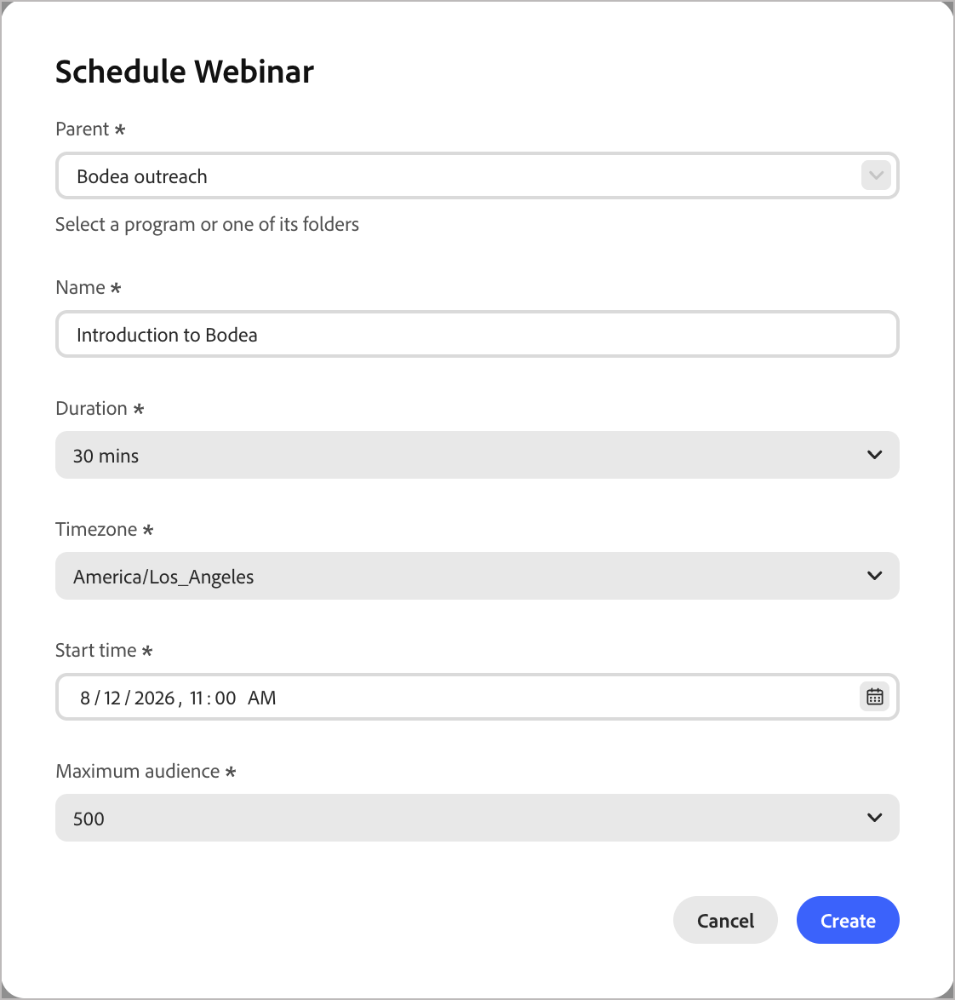

# Creare e progettare un webinar

Aggiungere un webinar a un programma, progettare la registrazione e l&#39;esperienza di sala e utilizzarlo con i co-host e i relatori da [!DNL Marketo Optimizer]. Prima di iniziare, controlla [Panoramica dei webinar interattivi](webinars-overview.md) per i concetti alla base degli stati, dei token e dei ruoli del webinar e verifica di disporre del ruolo **Crea e gestisci webinar**.

## Aggiungere un webinar a un programma

1. Individuare il programma nella struttura ad albero _[!UICONTROL Programmi]_ o [creare un programma](./programs.md#create-program).

1. Fai clic sull&#39;icona _Altro menu_ ( **...** ) accanto al nome del programma e seleziona **[!UICONTROL Crea webinar]**.

1. Nella finestra di dialogo, immetti i dettagli del webinar di base:

   * **Titolo** e **Descrizione**.
   * **Pianificazione** - data e ora di inizio, fuso orario e durata.
   * **Pubblico massimo** - Capacità di licenza del webinar da utilizzare per questa sessione.

   {width="500" zoomable="yes"}

   >[!NOTE]
   >
   >La consegna singola o ricorrente e le opzioni audio/video non sono attualmente configurabili. Ogni webinar è una singola sessione video abilitata.

1. Aggiungi **co-host** e **relatori**.

   >[!NOTE]
   >
   >Nella versione corrente è possibile aggiungere tutti gli utenti come contatto esterno per nome e indirizzo di posta elettronica, indipendentemente dal fatto che dispongano di un account Adobe SSO idoneo per il ruolo.<!-- See [Permissions](./webinars-overview.md#permissions) for what each role governs. --> Per i passaggi completi, vedere [_Aggiungere co-host e relatori_](#add-co-hosts-and-presenters).

1. (Facoltativo) Personalizzare il modello, il marchio e il layout della room.

   Queste opzioni vengono gestite in [!DNL Adobe Connect] e possono essere ridefinite in un secondo momento dall&#39;area di progettazione. Consulta [Progettare il webinar](#design-the-webinar).

1. Fai clic su **[!UICONTROL Salva]**.

   Il salvataggio registra il webinar nel programma e ne rende disponibili token, attributi e attività per ogni percorso e risorsa di tale programma.

>[!NOTE]
>
>L&#39;authoring dei webinar equivale a _Webinar interattivi_ in [!DNL Marketo Engage], pertanto i campi sono noti se l&#39;operazione è stata eseguita tramite tale applicazione.

## Progettare il webinar {#design-the-webinar}

Per aprire l&#39;area di progettazione [!DNL Adobe Connect], incorporata direttamente in [!DNL Marketo Optimizer], in cui configurare la room, la pagina di registrazione e i layout, utilizzare _[!UICONTROL Progetta il webinar]_.

1. Nella pagina del webinar, fai clic su **Progetta il webinar**.

1. Scegli una **modalità di consegna**:

   - **Live** - I relatori ospitano la sessione in tempo reale.
   - **Live simulato**: i contenuti preregistrati vengono riprodotti all&#39;ora pianificata, insieme a chat in diretta, sondaggi e domande e risposte.

1. Scegli una **sala webinar**.

   Creare una nuova room o riutilizzarne una esistente.

1. Seleziona un **Modello**, **Lingua** e **Tema**, quindi visualizza l&#39;anteprima del layout.

1. Aggiungi e disponi i pod come necessario.

   I pod disponibili includono Condivisione, Appunti, Video, Chat, Elenco partecipanti, File, Collegamenti Web, Sondaggi, Domande e risposte e Sondaggio.

1. Entra nella stanza per rivedere l&#39;esperienza, quindi esci al termine.

1. Salva le modifiche.

   Viene visualizzata una conferma per indicare che il webinar è stato progettato correttamente.

>[!TIP]
>
>Progetta il webinar prima di aggiungere co-host e relatori, in modo che i relativi accessi e controlli si applichino alla sala finita.

La personalizzazione della stanza, ad esempio logo, colori e sfondi virtuali, viene gestita direttamente in [!DNL Adobe Connect].

## Aggiungere co-host e relatori {#add-co-hosts-and-presenters}

1. Nella pagina del webinar, vai alla sezione **Team del webinar**.

1. Fare clic su **Aggiungi co-host** o **Aggiungi relatore**.

1. Nella finestra di dialogo, immetti il **[!UICONTROL nome]**, **[!UICONTROL cognome]** e **[!UICONTROL indirizzo e-mail]** della persona, quindi fai clic su **[!UICONTROL Aggiungi]**.

   >[!NOTE]
   >
   >Nella versione corrente, tutti vengono aggiunti nello stesso modo, per nome e per e-mail, indipendentemente dal fatto che abbiano o meno un account SSO di Adobe. Consulta [Autorizzazioni](webinars-overview.md#permissions) per conoscere i ruoli di **co-host webinar** e **relatore webinar** che governano una volta aggiunto un utente.

   Una conferma viene visualizzata dopo l&#39;aggiunta della persona, che viene elencata in **Co-host** o **Presentatori** nella sezione Team del webinar.

## Testare il webinar {#test-the-webinar}

Prima di promuovere il webinar, esegui una sessione di test per confermare che la room, i pod e il presentatore accedano a tutte le funzioni come previsto.

>[!NOTE]
>
>La modalità di test non influisce sullo stato dei membri del webinar di alcun utente. Puoi eseguire un test tutte le volte che ti servono senza registrarti o invitare nessuno.

## Modificare un webinar live {#edit-a-live-webinar}

Puoi modificare un webinar dopo l’avvio delle registrazioni, ma fai attenzione a farlo:

- La modifica della pianificazione può attivare le notifiche di aggiornamento per le persone già registrate. È possibile configurare la possibilità di modificare i webinar pianificati.
- I campi a cui fanno riferimento i token nelle e-mail live richiedono una conferma esplicita per la rimozione, in quanto così facendo si interrompe il contenuto già pianificato per l’invio.
