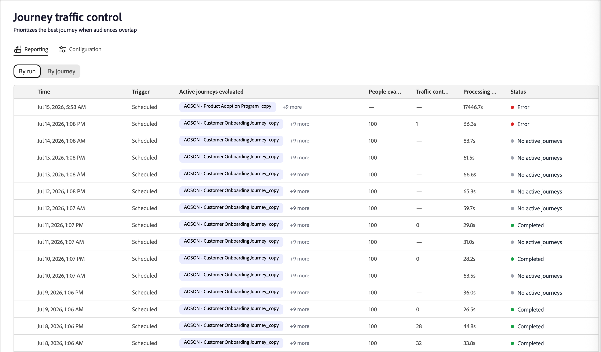

# Controllo traffico percorso

Il controllo del traffico di percorso (JTC) dà priorità al percorso migliore per una persona quando i tipi di pubblico si sovrappongono. Quando una persona è idonea per più percorsi abilitati per JTC, un modello di IA li valuta rispetto a ciascun candidato e li aggiunge al percorso più adatto, tenendoli fuori dagli altri.

>[!NOTE]
>
>Il controllo del traffico di percorso funziona allo stesso modo per [!DNL Journey Optimizer B2B Edition] e [!DNL Marketo Optimizer]. La funzionalità e la logica sono identiche; esistono solo lievi differenze nell’interfaccia utente tra i livelli. Le informazioni in questa pagina riflettono l&#39;esperienza [!DNL Marketo Optimizer].

Dopo che la persona ha completato il percorso, vengono rivalutati per i percorsi rimanenti per i quali rimane qualificata. JTC li aggiunge quindi al successivo percorso più adatto e così via. In questo modo, si evita di assegnare contemporaneamente la stessa persona a più percorsi sovrapposti e si garantisce che ogni contatto riceva per primo l’esperienza più rilevante.

>[!NOTE]
>
>Attualmente, una persona può essere inserita in un solo percorso selezionato da JTC alla volta. Per una versione futura è pianificata un’opzione di configurazione amministratore che consente a una persona di essere iscritta contemporaneamente a più di un percorso.

## Dimensioni punteggio {#scoring-dimensions}

Il modello valuta ogni combinazione di percorso di persone in sette dimensioni di punteggio. Ogni dimensione viene valutata in modo indipendente e quindi combinata, in base ai pesi configurati, per produrre una probabilità di corrispondenza finale per quella persona e quel percorso. Viene selezionato il percorso con la corrispondenza più forte.

| Dimensione | Cosa valuta |
|---|---|
| Allineamento intento | Segnali di intento comportamentale: ricerche per parole chiave, visite alle pagine dei prodotti, download di contenuti, aperture e-mail/click-through di e attività di pagina dei prezzi. |
| Adattamento pubblico | La persona corrisponde al pubblico [di destinazione](./person-audience-node.md) per il percorso. |
| Adatta persona | Allineamento tra il ruolo della persona/[persona](../audiences/personas.md) e il percorso. |
| Adattamento firmware | Attributi a livello di azienda (come industria, dimensioni e ricavi). |
| Corrispondenza demografica | Attributi demografici a livello di persona. |
| Allineamento psicografico | Allineamento attitudinale/basato su preferenze. |
| Adattamento al coinvolgimento | Recency e livello di approfondimento del [coinvolgimento](../audiences/engagement-scores.md) della persona. |

Le dimensioni per le quali una persona non dispone di dati vengono ignorate automaticamente, pertanto il punteggio non viene mai penalizzato per gli attributi mancanti.

>[!IMPORTANT]
>
>Per poter eseguire un&#39;operazione significativa, è necessario che almeno due percorsi abbiano JTC abilitato. Abilitarla in un singolo percorso è inefficace, in quanto non esiste un percorso concorrente per l&#39;arbitrato. Solo quando due o più percorsi sono abilitati per JTC, il modello inizia a risolvere i conflitti.

## Prerequisiti {#prerequisites}

Prima che il controllo del traffico di percorso possa produrre risultati, tieni presente quanto segue:

* **Il reporting richiede un percorso pubblicato e abilitato per JTC.** La scheda _[!UICONTROL Generazione rapporti]_ non mostra alcun dato finché non viene pubblicato almeno un percorso con il controllo del traffico di percorso abilitato.
* **La simulazione richiede almeno un percorso pubblicato nell&#39;istanza.** La simulazione valuta [profili](../audiences/people-lists.md) già presenti in percorsi live, pertanto è necessario almeno un percorso pubblicato nell&#39;istanza da cui estrarre i profili. La simulazione stessa non richiede l&#39;attivazione di JTC (vedere [_Simulare punteggio_](#simulate-scoring)).

## Introduzione {#get-started}

Selezionare **[!UICONTROL Controllo del traffico di Percorso]** nel menu di navigazione a sinistra. La pagina visualizzata presenta due schede:

* **[!UICONTROL Generazione rapporti]** - Visualizza i risultati delle esecuzioni del controllo del traffico (popolato solo dopo l&#39;esecuzione di JTC nei percorsi live).
* **[!UICONTROL Configurazione]**: regola le dimensioni di punteggio, simula i risultati e scegli i percorsi partecipanti.

>[!IMPORTANT]
>
>Per un nuovo cliente che non ha mai utilizzato il controllo del traffico di percorso, la scheda _[!UICONTROL Generazione rapporti]_ è vuota. Il reporting riflette solo i percorsi a cui è stato applicato e in esecuzione il controllo del traffico. Inizia dalla scheda _[!UICONTROL Configurazione]_.

## Scheda Configurazione {#configuration-tab}

La scheda _[!UICONTROL Configurazione]_ include due sezioni: **[!UICONTROL Regola punteggio dimensione]** e **[!UICONTROL Seleziona percorsi]**.

### Regolare il punteggio della dimensione {#adjust-dimension-scoring}

In questa sezione viene impostato il contributo di ciascuna delle sette dimensioni al punteggio di corrispondenza finale. Ogni dimensione può essere impostata su **[!UICONTROL Off]**, **[!UICONTROL Low]**, **[!UICONTROL Medium]** o **[!UICONTROL High]**. La percentuale visualizzata su ogni carta è il contributo normalizzato di quella dimensione dopo aver combinato tutte le selezioni: i sette pesi totalizzano sempre il 100%. L’aumento di una dimensione normalizza automaticamente le altre in modo che il totale rimanga al 100%.

Fai clic su **[!UICONTROL Ripristina uguale]** per riportare tutte le dimensioni a una ponderazione uniforme.

{width="800" zoomable="yes"}

### Simula punteggio {#simulate-scoring}

Prima di eseguire il commit dei pesi in produzione, è possibile simulare il comportamento del controllo del traffico con tali modifiche. La simulazione non richiede l&#39;attivazione del controllo del traffico di percorso. Valuta i profili già presenti nei percorsi live e applica loro la logica di controllo del traffico, in modo da poter giudicare se i risultati sono adatti per i pesi scelti.

1. Scegli quanti profili simulare.

1. Fare clic su **[!UICONTROL Simula punteggio]**.

L’intestazione dei risultati riepiloga l’esecuzione:

* **Profili valutati**: quanti profili hanno ottenuto un punteggio e in quanti percorsi.
* **Conflitti medi/profilo** — il numero medio di percorsi concorrenti per profilo.
* **Punteggio di corrispondenza medio**: l&#39;affidabilità media dei percorsi selezionati.

{width="700" zoomable="yes"}

Sotto il riepilogo, ogni profilo valutato viene visualizzato come una scheda che mostra il percorso selezionato, la motivazione chiave, i segnali di intento e il punteggio di corrispondenza. Selezionare un profilo con cui aprire una visualizzazione dei dettagli:

* **Match score** — Corrispondenza complessiva, con una suddivisione a colori per dimensione.
* **Decisione**: i percorsi per i quali questa persona si è qualificata, per i quali è stata selezionata una decisione e perché.
* **Punteggi Dimension per peso**: i punteggi per dimensione che hanno determinato la decisione, espandibili per mostrare i segnali sottostanti.

{width="450" zoomable="yes"}

Quando sei soddisfatto del risultato, puoi:

* Regola i pesi delle dimensioni e fai clic su **[!UICONTROL Esegui di nuovo]** per eseguire nuovamente la simulazione.

* Fai clic su **[!UICONTROL Applica alla produzione]** per confermare i pesi.

  Le nuove decisioni sul controllo del traffico utilizzano immediatamente le nuove impostazioni; le decisioni passate non vengono influenzate. I pesi testati vengono visualizzati nella scheda principale _[!UICONTROL Configurazione]_ e vengono utilizzati per tutti i percorsi che il controllo del traffico sta valutando nell&#39;ambiente live.

Puoi anche lasciare la pagina senza applicare i pesi.

<!--

This section does not appear in the staging environment

### Select journeys {#select-journeys}

The _[!UICONTROL Select journeys]_ section is where you choose which journeys participate in traffic control.

>[!IMPORTANT]
>
>Only draft journeys are available for selection. Traffic control cannot be enabled for a journey that is already live. When JTC is enabled for a journey and then that journey is published, it cannot be disabled.

-->

## Attiva controllo traffico per percorsi {#enable-traffic-control-journey}

Quando il controllo del traffico di percorso è abilitato e vengono pubblicati due o più percorsi:

* Le persone idonee per uno o più di questi percorsi vengono valutate in base al loro profilo e ai metadati del percorso.
* Se una persona è idonea per più percorsi abilitati per JTC contemporaneamente (ad esempio, cinque), il modello determina quale sia il percorso migliore in quel momento e iscrive la persona a quel percorso solo. Sono tenuti fuori dagli altri.
* La persona procede attraverso quel percorso fino al completamento.
* Al termine, vengono rivalutati rispetto ai percorsi rimanenti per i quali sono ancora qualificati e aggiunti al migliore successivo, ripetendo fino a quando non rimangono percorsi qualificati.

### Abilita JTC per un percorso 2D {#enable-traffic-control-draft-journey}

Il controllo del traffico di percorso può essere abilitato direttamente su un singolo percorso quando si trova nello stato _Bozza_. <!-- This is the same setting surfaced from the admin/configuration flow — enabling it in either place keeps the two in sync. -->

1. Nella barra di navigazione a sinistra, espandere **[!UICONTROL Gestione marketing]**.

1. Sulla destra nell&#39;elenco delle risorse **[!UICONTROL Marketing]**, seleziona **[!UICONTROL percorsi di persone]**.

1. Fare clic sul nome del percorso di persone in bozza per aprirlo.

1. Fare clic su **[!UICONTROL ... Altro]** in alto a destra e scegli **[!UICONTROL Impostazioni controllo traffico Percorso]**.

   {width="700" zoomable="yes"}

1. Nella finestra di dialogo, abilita l&#39;opzione **[!UICONTROL Abilita controllo traffico di percorso]**.

   La finestra di dialogo delle impostazioni spiega il comportamento: se abilitata, il percorso diventa un candidato e il modello valuta e consiglia il percorso più adatto per una persona qualificata per più percorsi attivi.

   {width="380"}

1. Fai clic su **[!UICONTROL Salva]**.

>[!IMPORTANT]
>
>L&#39;interruttore può essere modificato in qualsiasi momento finché il percorso rimane nello stato _Bozza_. <!-- If it was already enabled from the admin section (or previously enabled by someone else), the toggle appears on. --> Dopo aver pubblicato il percorso con JTC abilitato, il controllo del traffico valuta l’ingresso in tale percorso e non puoi più disabilitare l’impostazione.

### Ottimizza la descrizione del percorso {#optimize-journey-description}

L&#39;agente di controllo del traffico può utilizzare efficacemente i metadati di un percorso, i nodi del percorso, il nome del pubblico e segnali strutturali simili, per orientare la sua decisione. Tuttavia, trae grande vantaggio da una descrizione ricca e descrittiva del percorso che indica chiaramente lo scopo e gli obiettivi del percorso.

Una descrizione dettagliata fornisce al modello il contesto necessario per prendere una decisione più informata sull&#39;appartenenza di una persona a quel percorso rispetto a un gruppo concorrente. Questo è più importante quando un percorso è molto basilare. Ad esempio, un percorso con pochi nodi offre un contesto limitato, pertanto una descrizione chiara del suo obiettivo e del pubblico di destinazione aiuta il modello a scegliere correttamente.

>[!TIP]
>
>Considera la descrizione del percorso come un input per il modello decisionale, non solo per la documentazione interna. Descrivi lo scopo del percorso (cosa sta cercando di raggiungere), i suoi obiettivi e il pubblico a cui è destinato. Più esplicita è la descrizione, più accuratamente il controllo del traffico può arbitrare quando una persona si qualifica per più percorsi sovrapposti, in particolare per percorsi leggeri con pochi nodi.

## Scheda Report {#reporting-tab}

Dopo aver abilitato il controllo del traffico per due o più percorsi con esecuzioni completate, nella scheda _[!UICONTROL Generazione rapporti]_ vengono visualizzati i risultati. Sono disponibili due visualizzazioni: **[!UICONTROL Per esecuzione]** e **[!UICONTROL Per percorso]**.

### Per esecuzione {#by-run}

Nella visualizzazione _[!UICONTROL Per esecuzione]_ sono elencati tutti i controlli del traffico eseguiti. Per ogni esecuzione, puoi visualizzare il tempo, l’attivatore (pianificato o manuale), i percorsi attivi valutati, le persone valutate, le decisioni sul controllo del traffico, il tempo di elaborazione e lo stato. Seleziona un’esecuzione per aprire un pannello dei dettagli con queste metriche chiave per l’esecuzione, insieme all’elenco dei percorsi valutati in tale esecuzione.

{width="700" zoomable="yes"}

### Per percorso {#by-journey}

Utilizza la visualizzazione _Per percorso_ per verificare in che modo il controllo del traffico ha interessato un determinato percorso. La tabella mostra, per percorso, il numero di persone valutate, iscritte a questo percorso, spostate in altri percorsi e già attive.

{width="700" zoomable="yes"}

<!--
Selecting a journey opens a detail panel:

* **Summary** — Total people evaluated, broken down into _Enrolled in this journey_, _Moved to other journeys_, and _Already active_.
* **Competing journeys** — Every journey that had people competing with this one, and how many were enrolled in each.
* **People evaluated** — The individual people, each with an outcome (_Enrolled_, _Moved_, or _Already active_), competing journeys, and match score.

>[!TIP]
>
>The sum of enrolled people across all competing journeys always equals the _Moved to other journeys_ count in the summary. _Already active_ means the person was already in the journey when the evaluation occurred.

Selecting an individual person shows the same detail view as in simulation: the match score, the decision (competing journeys and which journey was selected and why), and the full dimension breakdown behind the selection.
-->
