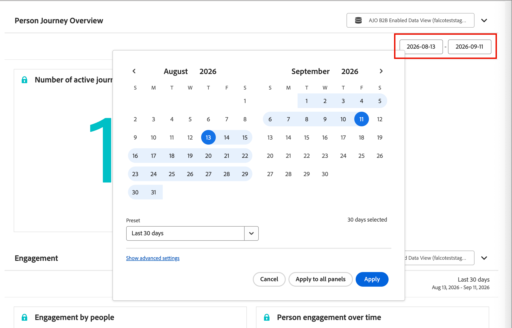

# Rapporti

La scheda [!UICONTROL Rapporti] fornisce informazioni sulle prestazioni in [!DNL Adobe Marketo Optimizer], tra cui coinvolgimento del percorso, prestazioni e-mail e attività Web. Nel menu di navigazione a sinistra, seleziona **[!UICONTROL Rapporti]** per aprirlo.

Ogni report è generato su [!DNL Adobe Customer Journey Analytics] e incorporato direttamente in [!DNL Marketo Optimizer]. Fai clic sull&#39;icona _Elenco_ (  ) per utilizzare il pannello **[!UICONTROL Sommario]** a sinistra per spostarti tra le sezioni.

{width="800" zoomable="yes"}

## Sezioni dei rapporti {#report-sections}

La scheda [!UICONTROL Rapporti] organizza i rapporti predefiniti in quattro sezioni. Ogni sezione ha uno o più elementi scaricabili e una propria pagina di documentazione con dettagli sulle relative metriche e visualizzazioni.

| Sezione | Elementi scaricabili | Pagina del rapporto |
| --- | --- | --- |
| [!UICONTROL Panoramica Percorso di persone] | Numero di percorsi attivi | [Rapporto Panoramica Percorso di persone](./person-journey-overview-report.md) |
| [!UICONTROL Coinvolgimento] | Coinvolgimento da parte delle persone, coinvolgimento della persona nel tempo | [Rapporto sul coinvolgimento](./engagement-report.md) |
| [!UICONTROL Coinvolgimento e-mail] | Coinvolgimento e-mail | [Rapporto di coinvolgimento e-mail](./email-engagement-report.md) |
| [!UICONTROL Coinvolgimento Web] | Visualizzazioni pagina principali | [Report di Web Engagement](./web-engagement-report.md) |

## Rapporti record singoli {#individual-record-reports}

Alcuni rapporti si concentrano su un singolo record anziché su una visualizzazione a livello di sezione e sono accessibili da un&#39;area diversa dell&#39;applicazione.

* Per le prestazioni di ottimizzazione dell&#39;ora di invio dell&#39;e-mail, apri il report dall&#39;interfaccia chat di [!UICONTROL Collaboratore]. Per i passaggi, consulta [Ottimizzazione dell&#39;ora di invio dell&#39;e-mail](../marketing/email-send-time-optimization.md#reporting).
* Per informazioni sull’avanzamento di una persona in un singolo percorso, apri il rapporto dall’interno di tale percorso.

## Esportare un rapporto {#export-a-report}

Seleziona **[!UICONTROL Condividi]** nella parte superiore della pagina del report per esportare o pianificare la consegna dei dati.

{width="500"}

* **[!UICONTROL Scarica CSV]** - Esporta i dati del rapporto come valori di testo normale.

* **[!UICONTROL Scarica PDF]** - Esporta tutte le tabelle e le visualizzazioni visibili nel rapporto come file PDF.

* **[!UICONTROL Pianifica esportazione]** - Configura un&#39;esportazione ricorrente del rapporto, consegnata settimanalmente o mensilmente come file CSV o PDF.

* **[!UICONTROL Gestisci pianificazioni]** - Esamina e gestisci le esportazioni pianificate esistenti. L&#39;opzione mostra un conteggio parziale, ad esempio `3/10`, delle pianificazioni utilizzate rispetto al limite dell&#39;organizzazione.

>[!NOTE]
>
>L’organizzazione può avere un massimo di 10 esportazioni pianificate in tutti i rapporti, con frequenza settimanale o mensile. Se non sei un amministratore, puoi gestire solo le esportazioni pianificate. Gli amministratori possono visualizzare e gestire ogni esportazione pianificata nell’organizzazione.

## Analizzare un report in [!DNL Customer Journey Analytics] {#analyze-a-report-in-cja}

>[!AVAILABILITY]
>
>Questa funzione è disponibile se la tua organizzazione dispone della licenza per [!DNL Adobe Customer Journey Analytics] e ti è stato assegnato il profilo di prodotto.

Seleziona **[!UICONTROL Analizza in CJA]** in qualsiasi sezione del report per aprirlo in [!DNL Adobe Customer Journey Analytics] Workspace, dove puoi creare visualizzazioni personalizzate oltre a quelle disponibili nel report incorporato.

## Modificare l’intervallo di date {#change-the-date-range}

Ogni sezione del rapporto mostra i dati per un intervallo di date specifico, visualizzati nell’angolo in alto a destra della sezione. Fai clic sui campi dell’intervallo di date per visualizzare gli strumenti di selezione della data e selezionare l’intervallo di date. Puoi scegliere un predefinito diverso o definire un intervallo personalizzato.

{width="600"}
